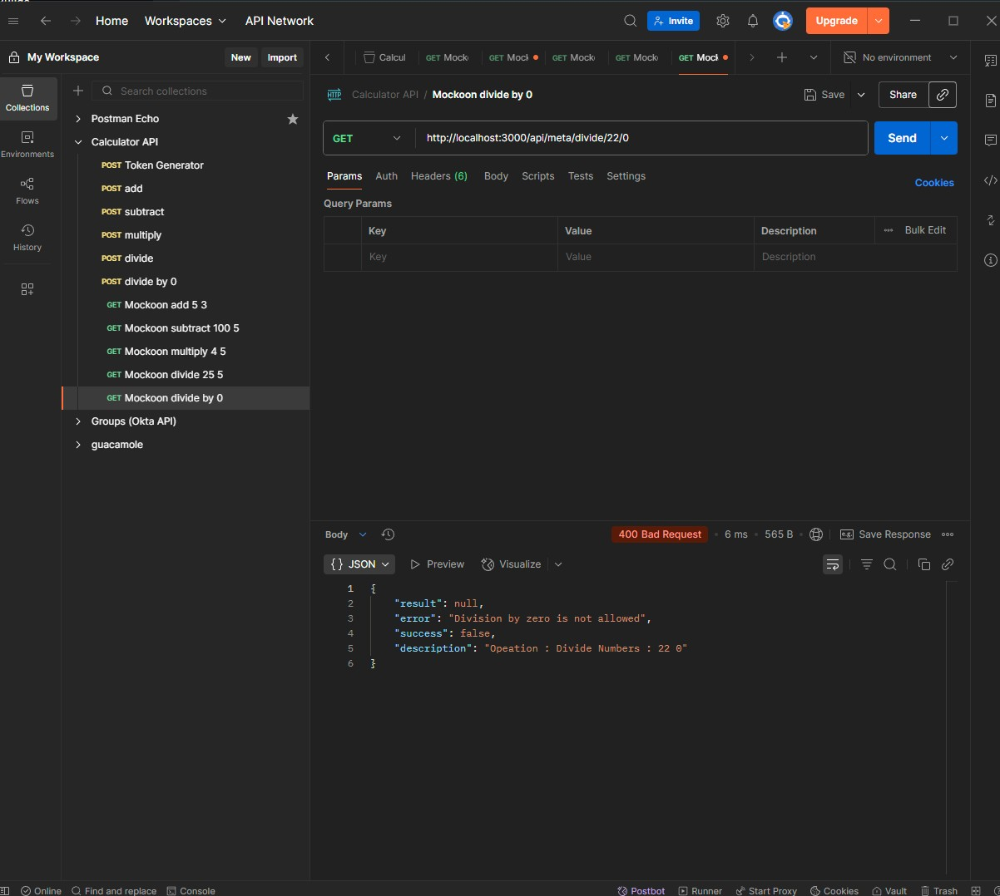

# Calculator API

A comprehensive .NET 9 Web API for mathematical operations with JWT authentication, Redis caching, and Kafka event streaming built with .NET Aspire.

## 📋 Project Overview

This project demonstrates a modern, scalable calculator API that includes:

- **JWT Bearer Authentication** - Secure API endpoints with token-based authentication
- **Redis Caching** - High-performance caching for mathematical operations
- **Kafka Event Streaming** - Real-time event processing for calculation workflows
- **System.Text.Json** - Modern JSON serialization (migrated from Newtonsoft.Json)
- **.NET Aspire** - Cloud-native orchestration and observability
- **Comprehensive Testing** - Unit and integration tests with real service dependencies
- **Swagger Documentation** - Interactive API documentation

### Technologies Used
- **.NET 9** - Latest .NET framework
- **ASP.NET Core Web API** - RESTful API framework
- **Redis** - In-memory caching and session storage
- **Apache Kafka** - Event streaming platform
- **JWT (JSON Web Tokens)** - Authentication and authorization
- **xUnit** - Testing framework with comprehensive test coverage
- **Docker** - Containerization support
- **Mockoon** - API mocking for testing
- **Serilog** - Structured logging with JSON formatting and file rotation

## 🚀 API Endpoints

### Authentication Endpoints
- `POST /api/token/generate` - Generate JWT authentication token

### Mathematical Operations
- `POST /api/math` - Perform mathematical calculations
  - **Operations Supported**: Addition, Subtraction, Multiplication, Division
  - **Headers Required**: 
    - `Authorization: Bearer {token}`
    - `X-ArithmeticOp-ID: {operation_id}`

## 🧪 Testing

The project includes comprehensive testing across multiple layers:

### How to Run Tests

To run all tests:
```bash
cd src/IO.Swagger.Tests
dotnet test
```

To run specific test categories:
```bash
# Unit tests only
dotnet test --filter Category=Unit

# Integration tests only
dotnet test --filter Category=Integration

# Run tests with detailed output
dotnet test --verbosity normal
```

### Running Specific Test Methods by Name

You can run individual test methods using the `--filter` parameter with the method name:

```bash
# Run a specific test method
dotnet test --filter "PerformCalculationAsync_AddOperation_ReturnsCorrectResult"

# Run all tests in a specific test class
dotnet test --filter "MathServiceTests"

# Run specific integration test method
dotnet test --filter "MathApi_DivideByZero_ReturnsErrorResponse"

# Run tests containing specific text in method name
dotnet test --filter "Name~Add"

# Run multiple specific methods using OR operator
dotnet test --filter "Name=PerformCalculationAsync_AddOperation_ReturnsCorrectResult|Name=MathApi_DivideByZero_ReturnsErrorResponse"

# Run tests by namespace
dotnet test --filter "FullyQualifiedName~IO.Swagger.Tests.Unit"

# Run tests by class and method combination
dotnet test --filter "FullyQualifiedName~MathServiceTests&Name~Add"
```

### Advanced Test Filtering Examples

```bash
# Run tests by trait/category (if defined)
dotnet test --filter "TestCategory=Unit"

# Run tests excluding specific ones
dotnet test --filter "Name!=SlowTest"

# Run tests with priority (if Priority attribute is used)
dotnet test --filter "Priority=1"

# List all available tests without running them
dotnet test --list-tests
```

### API Testing with Postman



<!--  -->
<!-- Postman GIF temporarily removed due to file size - will be added back with Git LFS -->

The project includes a complete Postman collection for interactive API testing located in `/postman/Calculator API.postman_collection.json`.

### Postman + Redis demo

<a href="https://youtu.be/n5V-YkyUEtA" target="_blank">
  
</a>

### Unit Tests
- **MathService Tests** - Core mathematical operation logic
- **AuthenticationService Tests** - Token generation and validation
- **RedisService Tests** - Direct Redis integration without mocks

### Integration Tests  
- **MathAPI Integration Tests** - End-to-end API testing with authentication
- **Redis Integration Tests** - Real Redis caching behavior
- **Authentication Integration Tests** - Complete auth workflow testing
- **Comprehensive Integration Tests** - Full workflow including Kafka events
- **MockoonIntegrationTests.cs** - External service mocking and API endpoint testing

### Test Features
- **Real Service Dependencies** - Tests use actual Redis and application host
- **Parameterized Tests** - Theory-based tests with multiple scenarios
- **Error Handling** - Comprehensive error scenario coverage
- **Performance Testing** - Concurrent operation testing

## 📊 Architecture Overview


The application uses .NET Aspire for orchestration, providing:
- Service discovery and configuration
- Health monitoring and observability
- Integrated Redis and Kafka management


### Aspire Demonstration

[](https://youtu.be/YHJym4HUYAE)


## 🔧 Getting Started

### Prerequisites
- .NET 9 SDK
- Docker Desktop

### Quick Start

```bash
cd src/IO.Swagger.AppHost
dotnet run
```

This will start all services including API (IO.Swagger), Redis, Redis Insight, Kafka, Kafka UI, Mockoon with the Aspire dashboard available at `https://localhost:17123`.

## 📁 Project Structure

```
├── src/
│   ├── IO.Swagger/              # Main Web API project
│   ├── IO.Swagger.AppHost/      # .NET Aspire orchestration
│   ├── IO.Swagger.Models/       # Data models and DTOs
│   ├── IO.Swagger.Services/     # Business logic and external services
│   └── IO.Swagger.Tests/        # Comprehensive test suite
├── mockoon/                     # API mocking configuration
├── postman/                     # Postman collection for API testing
└── images/                      # Documentation images
```

## 🔄 Event-Driven Architecture

The API publishes Kafka events for:
- **Calculation Started** - When a math operation begins
- **Calculation Completed** - When a math operation finishes (includes timing, cache hits, results)

Events include detailed metadata for analytics, monitoring, and audit trails.

## 📝 Robust Logging with Serilog

The application implements comprehensive structured logging using Serilog with the following features:

### Logging Architecture
- **Structured JSON Logging** - All logs use JSON format for better parsing and analysis
- **Correlation ID Tracking** - Every request gets a unique ID that follows it through all components
- **Multi-Sink Output** - Logs simultaneously to console and rotating files
- **Performance Monitoring** - Automatic detection of slow requests (>1 second)
- **Global Exception Handling** - Centralized error logging with context preservation

### Middleware Components
- **RequestResponseLoggingMiddleware** - Logs all HTTP requests/responses with full context
- **GlobalExceptionHandlingMiddleware** - Handles unhandled exceptions with structured error responses
- **PerformanceMonitoringMiddleware** - Monitors execution time and memory usage per request

### Log Levels and Filtering
```
Information: Application events, request/response logging
Warning: Slow requests, business logic warnings, non-critical errors  
Error: Exceptions, failures, critical application errors
Debug: Detailed performance metrics (development only)
```

### File Management
- **Location**: `logs/io-swagger-YYYY-MM-DD.log`
- **Rotation**: Daily log files with 30-day retention
- **Size Limit**: 100MB per file with automatic rollover
- **Format**: Compact JSON for efficient storage and parsing

### Log Context Enrichment
Each log entry includes:
- Correlation ID for request tracing
- Application name and environment
- Request path, method, and user agent
- Remote IP address and response times
- Memory usage and performance metrics

### Sample Log Output
```json
{
  "timestamp": "2025-08-06T10:30:00.123Z",
  "level": "Information", 
  "message": "Incoming request: POST /api/math",
  "correlationId": "abc123-def456",
  "requestMethod": "POST",
  "requestPath": "/api/math", 
  "applicationName": "IO.Swagger.API",
  "environment": "Development"
}
```

## 🚀 Process

- Created API using swaggerhub with HaloAI and download as .NET Core 3/5 project
- Upgrade to .NET 9 (latest versions of libraries)
- Add Aspire to allow for local orchestration with ease of use for Redis, Kafka, and Mockoon docker integration, no connections strings expose in appsettings
- Solutions structure refactored to separate concerns
- Set JWT authentication + TokenExpirationMiddleware
- Refactor to use System.Text.Json
- Used GitHub Copilot (Claude Sonnet 4) to refactor code, add tests and documentation

## 🐳 Docker Support

The project includes Docker support with containerization files generated by the .NET Aspire CLI using the `aspire publish` command. This provides:

- **Automated Container Generation** - Dockerfile and docker-compose.yaml files are automatically created
- **Multi-Service Orchestration** - Complete stack deployment with Redis, Kafka, and Mockoon
- **Production-Ready Configuration** - Optimized settings for containerized environments
- **Aspire Integration** - Native support for .NET Aspire observability and service discovery

### Running with Docker Compose

To run the entire application stack using Docker Compose:

```bash
# Build and start all services
docker-compose up --build

# Run in detached mode (background)
docker-compose up --build -d

# Stop all services
docker-compose down

# View logs from all services
docker-compose logs -f
```

The docker-compose.yaml file orchestrates the following services:
- **Calculator API** - Main web API service
- **Redis** - Caching and session storage
- **Kafka** - Event streaming platform
- **Mockoon** - API mocking service
- **Supporting Infrastructure** - Health checks, networking, and monitoring

### Aspire Publish Command

To generate Docker files for deployment:
```bash
cd src/IO.Swagger.AppHost
aspire publish
```

This creates production-ready Docker configurations including:
- Service containers with proper networking
- Environment variable configuration
- Health checks and monitoring
- Volume mounts for persistent data

## 📝 Configuration

The application supports configuration through `appsettings.json` (IO.Swagger):

```json
{
  "Jwt": {
    "Key": "YourSecretKey",
    "Issuer": "Calculator.API",
    "Audience": "Calculator.Client",
    "ExpiryInMinutes": 60
  },
  "Cache": {
    "MathTTLSeconds": 30
  },
  "Kafka": {
    "Topics": {
      "CalculationStarted": "calculation-started",
      "CalculationCompleted": "calculation-completed"
    }
  }
}
```

## 📄 License

This project is licensed under the MIT License.
