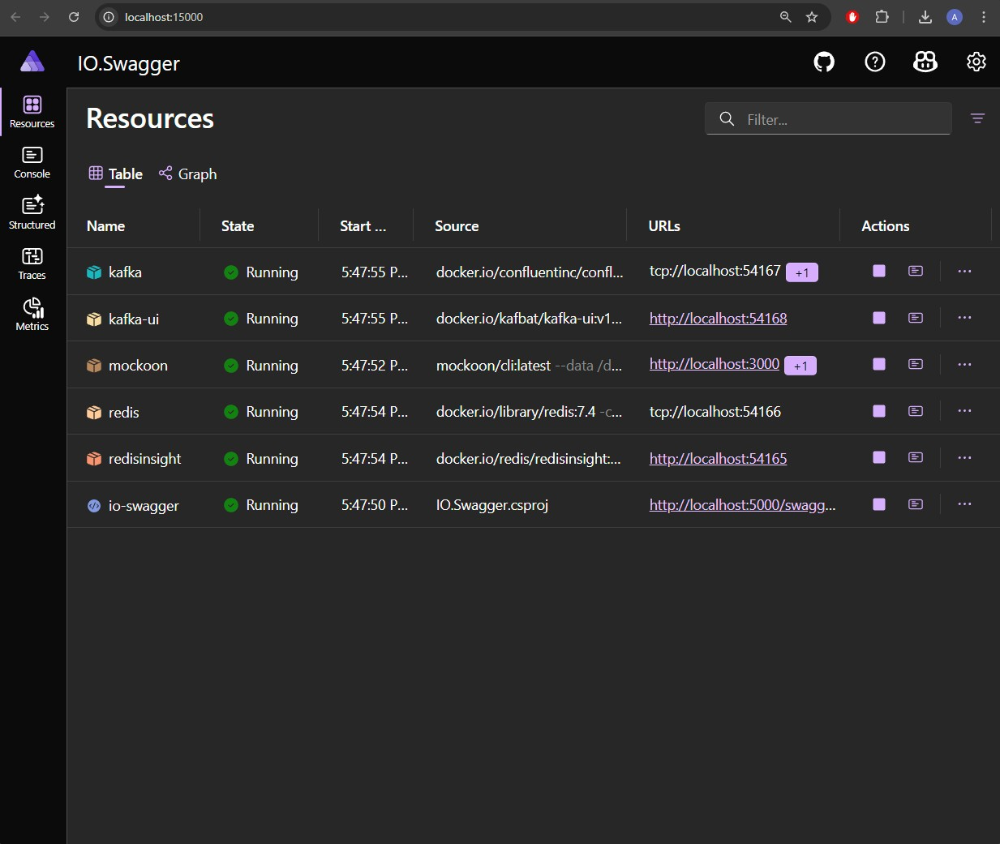
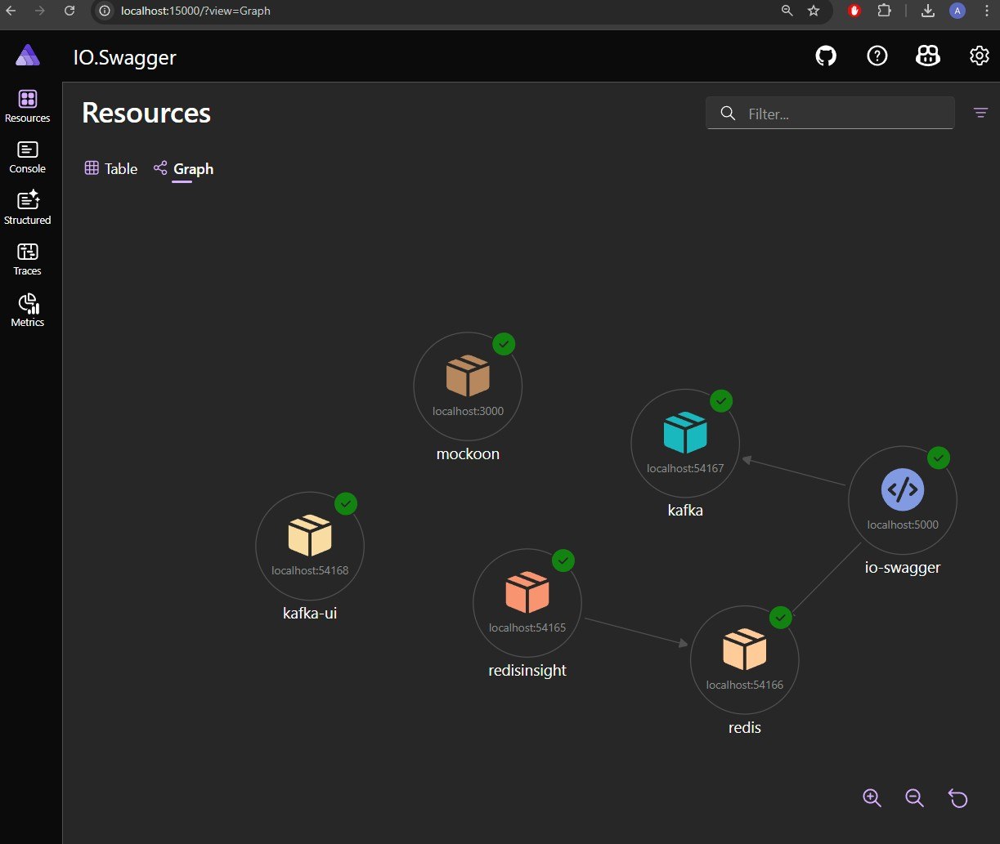

# Calculator API

A comprehensive .NET 9 Web API for mathematical operations with JWT authentication, Redis caching, and Kafka event streaming built with .NET Aspire.

## 📋 Project Overview

This project demonstrates a modern, scalable calculator API that includes:

- **JWT Bearer Authentication** - Secure API endpoints with token-based authentication
- **Redis Caching** - High-performance caching for mathematical operations
- **Kafka Event Streaming** - Real-time event processing for calculation workflows
- **System.Text.Json** - Modern JSON serialization (migrated from Newtonsoft.Json)
- **.NET Aspire** - Cloud-native orchestration and observability
- **Comprehensive Testing** - Unit and integration tests with real service dependencies
- **Swagger Documentation** - Interactive API documentation

### Technologies Used
- **.NET 9** - Latest .NET framework
- **ASP.NET Core Web API** - RESTful API framework
- **Redis** - In-memory caching and session storage
- **Apache Kafka** - Event streaming platform
- **JWT (JSON Web Tokens)** - Authentication and authorization
- **xUnit** - Testing framework with comprehensive test coverage
- **Docker** - Containerization support
- **Mockoon** - API mocking for testing

## 🚀 API Endpoints

### Authentication Endpoints
- `POST /api/token/generate` - Generate JWT authentication token

### Mathematical Operations
- `POST /api/math` - Perform mathematical calculations
  - **Operations Supported**: Addition, Subtraction, Multiplication, Division
  - **Headers Required**: 
    - `Authorization: Bearer {token}`
    - `X-ArithmeticOp-ID: {operation_id}`

### Health & Documentation
- `GET /health` - Health check endpoint
- `GET /swagger` - Swagger UI documentation
- `GET /swagger/1.0.0/swagger.json` - OpenAPI specification

## 🧪 Testing

The project includes comprehensive testing across multiple layers:

### API Testing with Postman

<!--  -->
<!-- Postman GIF temporarily removed due to file size - will be added back with Git LFS -->

The project includes a complete Postman collection for interactive API testing located in `/postman/Calculator API.postman_collection.json`.

### Unit Tests
- **MathService Tests** - Core mathematical operation logic
- **AuthenticationService Tests** - Token generation and validation
- **RedisService Tests** - Direct Redis integration without mocks

### Integration Tests  
- **MathAPI Integration Tests** - End-to-end API testing with authentication
- **Redis Integration Tests** - Real Redis caching behavior
- **Authentication Integration Tests** - Complete auth workflow testing
- **Comprehensive Integration Tests** - Full workflow including Kafka events

### Test Features
- **Real Service Dependencies** - Tests use actual Redis and application host
- **Parameterized Tests** - Theory-based tests with multiple scenarios
- **Error Handling** - Comprehensive error scenario coverage
- **Performance Testing** - Concurrent operation testing

## 📊 Architecture Overview



The application uses .NET Aspire for orchestration, providing:
- Service discovery and configuration
- Health monitoring and observability
- Integrated Redis and Kafka management



## 🔧 Getting Started

### Prerequisites
- .NET 9 SDK
- Docker Desktop
- Redis (via Docker or local installation)
- Apache Kafka (via Docker or local installation)

### Quick Start

```bash
cd src/IO.Swagger.AppHost
dotnet run
```

This will start all services including Redis, Kafka, and the API with the Aspire dashboard available at `https://localhost:17123`.

## 📁 Project Structure

```
├── src/
│   ├── IO.Swagger/              # Main Web API project
│   ├── IO.Swagger.AppHost/      # .NET Aspire orchestration
│   ├── IO.Swagger.Models/       # Data models and DTOs
│   ├── IO.Swagger.Services/     # Business logic and external services
│   └── IO.Swagger.Tests/        # Comprehensive test suite
├── mockoon/                     # API mocking configuration
├── postman/                     # Postman collection for API testing
└── images/                      # Documentation images
```

## 🔄 Event-Driven Architecture

The API publishes Kafka events for:
- **Calculation Started** - When a math operation begins
- **Calculation Completed** - When a math operation finishes (includes timing, cache hits, results)

Events include detailed metadata for analytics, monitoring, and audit trails.

## 🚀 Process

- Create API using swaggerhub with HaloAI feature and download as .NET Core 3/5 project
- Upgrade to .NET 9 
- Add Aspire to allow for local orchestration with ease of use for Redis, Kafka, and Mockoon docker integration
- Folder re structure
- Add JWT authentication + TokenExpirationMiddleware
- Refactor to use System.Text.Json
- 

## 📝 Configuration

The application supports configuration through `appsettings.json`:

```json
{
  "Jwt": {
    "Key": "YourSecretKey",
    "Issuer": "Calculator.API",
    "Audience": "Calculator.Client",
    "ExpiryInMinutes": 60
  },
  "Cache": {
    "MathTTLSeconds": 30
  },
  "Kafka": {
    "Topics": {
      "CalculationStarted": "calculation-started",
      "CalculationCompleted": "calculation-completed"
    }
  }
}
```

## 🤝 Contributing

1. Fork the repository
2. Create a feature branch
3. Run tests: `dotnet test`
4. Submit a pull request

## 📄 License

This project is licensed under the MIT License.
